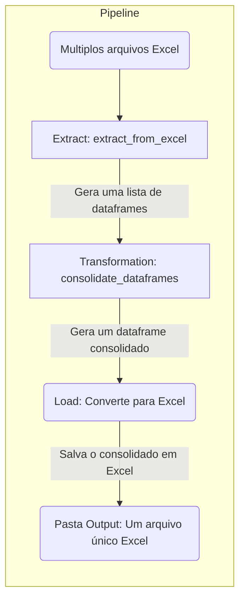

# Welcome to MkDocs

For full documentation visit [mkdocs.org](https://www.mkdocs.org).

## Workflow

mermaid

```mermaid
flowchart LR
    subgraph ETL[Pipeline]
        A(Multiplos arquivos Excel) --> B[Extract: extract_from_excel]
        B[Extract: extract_from_excel] --> |Gera uma lista de dataframes| C
        C[Transformation: consolidate_dataframes] --> |Gera um dataframe consolidado| D
        D(Load: Converte para Excel) --> |Salva o consolidado em Excel| E(Pasta Output: Um arquivo único Excel)
    end

```

## Exemplo de uma funcao

### ::: app.pipeline.extract.extract_from_excel
